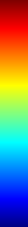
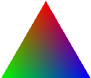
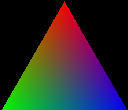

# Create_ColorBar
ImageJ plugin to create a color bar and RGB triangle. These are for color legends of Imaging XAFS data figures.

A color bar is created using the lookup table of current non-RGB image.  

An RGB triangle with white or black background is created and can be used with 
[PF_ImagingXAFS](https://github.com/yasuotake1/Create_ColorBar "yasuotake1/Create_ColorBar: ImageJ plugin for Imaging XAFS data analysis at KEK-PF BL-15A1 and PF-AR NW2A.")
, E0-Dmut map and RGB phase map.  
 

# Installation
Place Create_ColoBar.jar in /plugins/ folder.
